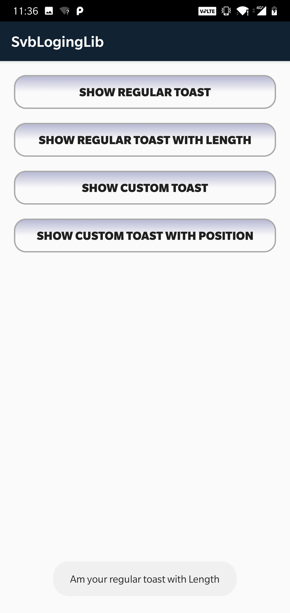
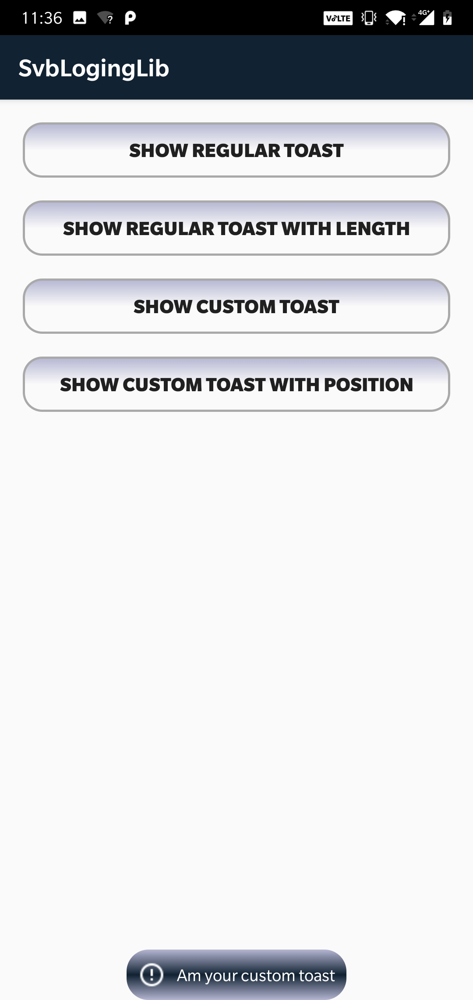
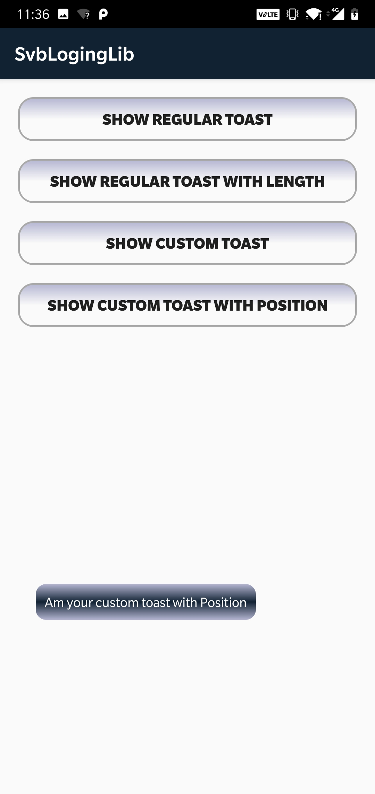

# Svb_Custom_Toast

Simple Custom Toast with image and text

To get a Git project into your build:

Step 1. Add the JitPack repository to your build file

Add it in your root build.gradle at the end of repositories:

	allprojects {
		repositories {
			...
			maven { url 'https://jitpack.io' }
		}
	}
  
Step 2. Add the dependency

	dependencies {
	 	implementation 'com.github.sharathvbhargav:Svb_Custom_Toast:0.0.3'
	}
	
To use Custom Toast in your project:
1. Regular Toast

		SvbToast.showToast(Context: context, String: message);
		
2. Regular Toast With Length

		SvbToast.showToast(Context: context, String: message, Boolean isLongToast);

3. Custom Toast
	
		SvbToast.showToast(
			Context: Application Context,
			String: Message to display,
			Drawable: Drawable Icon (null if icon is not needed),
			Int: Corner Radius for toast window,
			Int[]: Array of colors,
			Boolean: IsLongToast (true: Toast.LENGTH_LONG, false: Toast.LENGTH_SHORT) 
		);
	
4. Custom Toast in desired position (X,Y)
	
		SvbToast.showToast(
			Context: Application Context,
			String: Message to display,
			Drawable: Drawable Icon (null if icon is not needed),
			Int: Corner Radius for toast window,
			Int[]: Array of colors,
			Boolean: IsLongToast (true: Toast.LENGTH_LONG, false: Toast.LENGTH_SHORT) 
			Int: PositionX
			Int: PositionY
		);
		
Example:

	1. SvbToast.showToast(MainActivity.this, "Am your regular toast");
	
	2.SvbToast.showToast(MainActivity.this, "Am your regular toast with Length", true);

	3.SvbToast.showToast(
		MainActivity.this,
		"Am your custom toast",
		getResources().getDrawable(R.drawable.error),
		50,
		color,
		true);
		
	4. SvbToast.showToast(
		MainActivity.this,
		"Am your custom toast",
		getResources().getDrawable(R.drawable.error),
		50,
		color,images/
		true,
		-120,
		300);
		
Note: For Custom Toast send array of colors

	final int[] color = new int[] {
		Color.parseColor("#b5b6d2"),
		Color.parseColor("#112233"),
		Color.parseColor("#b5b6d2")};
		
	
Screenshots:

      
