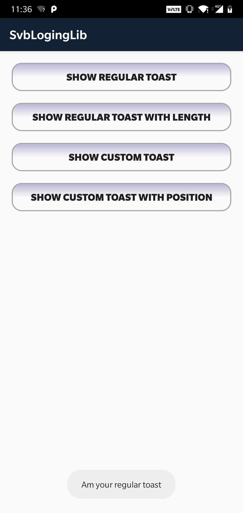

# Svb_Custom_Toast

Simple Custom Toast with image and text

To get a Git project into your build:

Step 1. Add the JitPack repository to your build file

Add it in your root build.gradle at the end of repositories:

	allprojects {
		repositories {
			...
			maven { url 'https://jitpack.io' }
		}
	}
  
Step 2. Add the dependency

	dependencies {
	 	implementation 'com.github.sharathvbhargav:Svb_Custom_Toast:0.0.3'
	}
	
To use Custom Toast in your project:

    ToastParams toastParams = new ToastParams(Context: context);

    toastParams.setMessage(String: message);
    toastParams.setIcon(Drawable: drawable);
    toastParams.setCornerRadius(Int: integer);
    toastParams.setGradientColors(Int[]: array of integers);
    toastParams.setTextColor(Int: integer);
    toastParams.setLongToast(Boolean: true/false);
    toastParams.setPositionX(Int: integer);
    toastParams.setPositionY(Int: integer);

    SvbToast.showToast(toastParams);

Example:

    ToastParams toastParams = new ToastParams(MainActivity.this);

    toastParams.setMessage("Hi am your Custom Toast");
    toastParams.setIcon(getResources().getDrawable(R.drawable.error));
    toastParams.setCornerRadius(50);
    toastParams.setGradientColors(color);
    toastParams.setTextColor(Color.WHITE);
    toastParams.setLongToast(true);
    toastParams.setPositionX(-120);
    toastParams.setPositionY(500);

    SvbToast.showToast(toastParams);

		
Array of colors

	final int[] color = new int[] {
		Color.parseColor("#b5b6d2"),
		Color.parseColor("#112233"),
		Color.parseColor("#b5b6d2")};
		
	
Screenshots:

      
